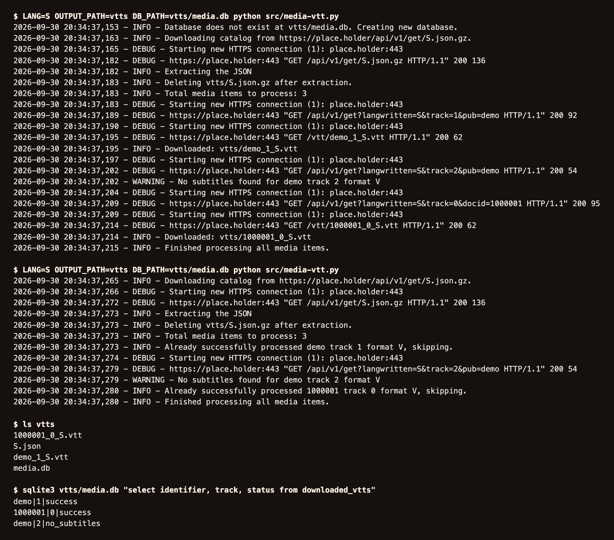

<p align="center">
  
</p>

<h1 align="center">media-download</h1>

<p align="center">
  <a href="https://github.com/GeiserX/media-download/actions/workflows/tests.yml"></a>
  <a href="LICENSE"></a>
  <a href="https://codecov.io/gh/GeiserX/media-download"></a>
</p>

Two Python scripts that mirror a publication catalog into a folder: `media-vtt.py` downloads the VTT subtitles of each media item, and `publications-epub.py` downloads the EPUB of each publication. Both keep a SQLite file of what they already fetched, so a rerun only gets what is new. The catalog endpoints in the source are placeholders (`https://place.holder/...`), so neither script runs until you set them.



## Quick start

Set the endpoints first (`grep -n place.holder src/*.py`); `publications-epub.py` also needs the catalog's `unit.db`, which the compose file mounts from `./db/unit.db`.

```bash
git clone https://github.com/GeiserX/media-download.git && cd media-download
docker compose up --build
```

Subtitles land in `./vtts` and EPUBs in `./epubs`, each next to its SQLite index. `LANG` in `docker-compose.yml` picks the catalog language.

## Documentation

The docs are at [geiserx.github.io/media-download](https://geiserx.github.io/media-download/).

- [Getting started](https://geiserx.github.io/media-download/getting-started/): setting the endpoints, Docker Compose, running without Docker
- [Usage](https://geiserx.github.io/media-download/usage/): running one script or both, reruns, reading the log and the output folder
- [Configuration](https://geiserx.github.io/media-download/configuration/): the environment variables, the endpoints in the source, the compose file
- [How it works](https://geiserx.github.io/media-download/how-it-works/): what each script asks the catalog for and what it records
- [Troubleshooting](https://geiserx.github.io/media-download/troubleshooting/): the errors people hit and what to put in an issue
- [Related projects](https://geiserx.github.io/media-download/related/): the sibling tools, including the one that saves a live web page
- [Development](https://geiserx.github.io/media-download/development/): tests, images, docs

## Related projects

| Project | Description |
|---------|-------------|
| [Wayback-Archive](https://github.com/GeiserX/Wayback-Archive) | Download complete websites from the Wayback Machine with full asset preservation |
| [Wayback-Diff](https://github.com/GeiserX/Wayback-Diff) | Web page comparison tool with Wayback Machine support |
| [Way-CMS](https://github.com/GeiserX/Way-CMS) | Simple web CMS for editing HTML/CSS files downloaded from Wayback Archive |
| [web-mirror](https://github.com/GeiserX/web-mirror) | Mirror a web page to a local server for offline access |
| [n8n-nodes-way-cms](https://github.com/GeiserX/n8n-nodes-way-cms) (archived) | n8n community node for Way-CMS archived web content management |

## License

[GPL-3.0-or-later](LICENSE)
